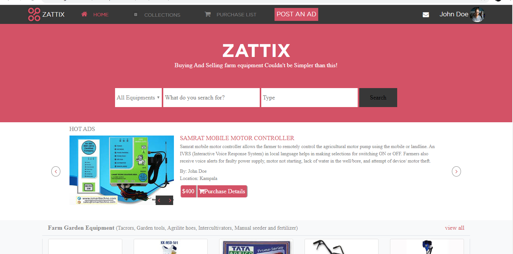

# Zatix

> Html Capstone Project - online shop for Farm Equipment

This online shop for farm equipment layout was designed folowing a design by ## Mohammed Awad on beehance.
All the design specification of Awad's design such as colour, typography and basic layouts were added to this project

## Built With

- html, css, Bootstrap
- vscode

## Live Demo

[Live Demo Link](https://raw.githack.com/frankopkusianwar/Zatix/Feature/index.html)

## Getting Started

To get a local copy up and running follow these simple example steps.

### Prerequisites
- Web browser
- Code editor
- Git and Github

### Usage
- Clone the project to your local machine 
- Open the index file in your browser

## Author

- Okiror Frank

👤 **Author details**

- Github: [Okiror Frank](https://github.com/frankopkusianwar)
- Twitter: [Okiror Frank](https://twitter.com/franko0781)
- Linkedin: [Okiror Frank](https://linkedin.com/in/frank-okiror-250076b5)
- Email: okirorfrank3@gmail.com

## 🤝 Contributing

Contributions, issues and feature requests are welcome!

Feel free to check the [issues page](issues/).

## Show your support

Give a ⭐️ if you like this project!

## Acknowledgments

- Mohammed Awad for the layout and design idea
- Microverse, standup team and the microverse community for helping build the skills that were used on this project

## 📝 License

This project is [MIT](lic.url) licensed.
